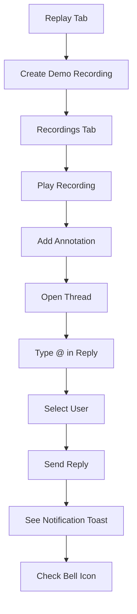

# @Mentions Quick Test Guide

## 🚀 Test @Mentions in 2 Minutes

### Step 1: Create Demo Recording (10 seconds)
1. Navigate to **Replay** tab (last tab with camera icon)
2. Click **"Start Demo Recording with Sample Data"** button
3. Switch to **"Recordings"** tab
4. You should see: **"🎯 Demo Session - Test @Mentions Here"**

### Step 2: Open the Recording (5 seconds)
1. Click **"Play"** button on the demo recording
2. Full-screen playback viewer opens

### Step 3: Add an Annotation (20 seconds)
1. Click **"Add Annotation"** button (top right, will be pulsing)
2. Fill in:
   - **Title**: "Test discussion"
   - **Category**: Select any (e.g., "Question")
3. Click **"Add Annotation"**

### Step 4: Test @Mentions (30 seconds)
1. Click **"Notes"** tab in right panel
2. Click your new annotation card
3. Thread panel slides in from the right
4. In reply box, type: `Can you review this @Alice?`
5. Watch autocomplete appear when you type `@`
6. Select **Alice** from dropdown (Arrow keys + Enter, or mouse click)
7. Click **"Reply"** button

### Step 5: See the Magic! ✨
- **Toast notification** shows: "🎉 Reply sent with mentions! Notified 1 person: @Alice"
- Your reply appears with **@Alice** highlighted in color
- **Bell icon** in top header shows notification badge (simulated)
- Reply is permanently saved to the recording

---

## 💡 What to Try Next

### Test Multiple Mentions
```
@Alice @Bob @Charlie can all of you review this metric?
```
Each mention triggers autocomplete separately!

### Test Keyboard Navigation
- Type `@` → Autocomplete appears
- Press `↓` → Move down suggestions
- Press `↑` → Move up suggestions  
- Press `Enter` → Select highlighted user
- Press `Esc` → Close suggestions

### Test Filtering
- Type `@Al` → Only shows "Alice"
- Type `@B` → Only shows "Bob"
- Case-insensitive matching!

---

## 🎯 Demo Recording Participants

The demo includes these users you can mention:

| User | ID | Color | Try Typing |
|------|-----|-------|------------|
| Alice | user-001 | Purple 🟣 | `@Alice` |
| Bob | user-002 | Blue 🔵 | `@Bob` |
| Charlie | user-003 | Green 🟢 | `@Charlie` |
| You | (your ID) | (your color) | `@YourName` |

---

## ✅ Success Checklist

- [ ] Demo recording created and visible
- [ ] Recording playback opens
- [ ] Annotation added successfully
- [ ] Thread panel opens on click
- [ ] Autocomplete appears when typing `@`
- [ ] User can be selected from dropdown
- [ ] Reply posted with highlighted mention
- [ ] Toast shows notification count
- [ ] Reply persists after closing/reopening

---

## 🔍 Visual Cues to Look For

### ✨ Autocomplete Working
- Dropdown appears below input when typing `@`
- Shows user avatars (colored circles with initials)
- Lists user names and IDs
- Selected item has blue/accent background
- Shows "Enter" hint on selected item

### ✨ Mention Sent Successfully
- Toast notification with party emoji 🎉
- Mentions count shown in toast
- Reply appears in thread immediately
- `@Username` has colored background
- Username shown in mentioned user's color

### ✨ Guided Testing Flow
- "Add Annotation" button pulses in demo recording
- Help tip shows in empty annotation list
- Contextual guidance in reply box when empty
- Keyboard shortcuts displayed

---

## 🛟 Troubleshooting

**Q: Autocomplete not showing?**
- Make sure cursor is in the reply input box
- Type `@` with nothing after it initially
- Click in the input and try again

**Q: Can't find the recording?**
- Check you're on "Recordings" tab (not "About")
- Look for title starting with "🎯 Demo Session"
- Try creating demo again if needed

**Q: Mention not highlighting?**
- Ensure you selected from dropdown (not just typed)
- Username must match exactly from dropdown
- Refresh and check if it appears

**Q: No notifications showing?**
- Notifications appear in top header bell icon
- Demo users won't actually receive notifications (they're test data)
- Toast message confirms notifications were "sent"

---

## 🎬 Complete Demo Workflow



---

## 📚 Related Documentation

- **Full Testing Guide**: `MENTIONS_TESTING_GUIDE.md` - Comprehensive testing instructions
- **Feature Documentation**: `MENTIONS_FEATURE_DOCS.md` - Technical details and API
- **Testing Summary**: `MENTIONS_TESTING_SUMMARY.md` - Test results and status

---

## 🎉 Why This Feature is Awesome

### For Collaboration
- **Target specific team members** instead of broadcast messages
- **Context-aware notifications** with direct links to discussions
- **Async communication** that doesn't interrupt flow

### For Analytics Reviews
- **Ask questions to data owners** right on the visualization
- **Loop in stakeholders** when insights need attention
- **Document decisions** with clear attribution

### For Training & Onboarding
- **Replay sessions** to see how teams collaborated
- **Annotate training recordings** with questions for trainers
- **Create tutorial recordings** with guided commentary

---

**🚀 Ready to test? Head to the Replay tab and create that demo recording!**
